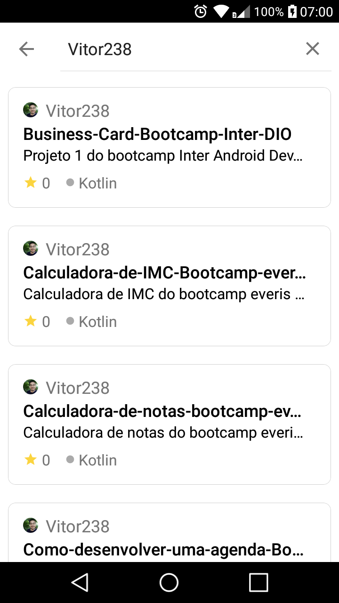

# LAB - Criando um App para Apresentar seu Portfólio do GitHub
O curso pode ser acessado na plataforma da [Digital Innovation One](https://digitalinnovation.one/).

##  Descrição do Lab.
Crie um App Android para apresentar seu portfólio de projetos do GitHub de maneira elegante e simplificada. Nesse contexto, você passará por todo o processo de desenvolvimento usando o Kotlin, uma das linguagens de programação de maior ascensão nos últimos anos. Por fim, você é desafiado a entregar seu próprio projeto, incorporando suas próprias evoluções e melhorias! Está preparado?

## Aulas e materiais de estudo.
- Aula - 01: Apresentação pessoal e apresentação do curso.
  - [Apresentação](https://drive.google.com/file/d/16KNz_Ee-_E6UmUlxVnqkIAjJX29-iTzE/view?usp=sharing)
- Aula - 02: Apresentando o projeto base.
- Aula - 03: Apresentação da Github API.
  - [API de REST do GitHub](https://docs.github.com/pt/rest)
- Aula - 04: Criando listagem de itens.
  - [sampledata](https://medium.com/android-news/android-tools-attributes-listitem-sample-data-rocks-bbf49aaa9f07)
  - [Material Chip](https://material.io/components/chips/android#using-chips)
- Aula - 05: Criando nosso menu.
- Aula - 06: Criando data module.
- Aula - 07: Criando domain module.
- Aula - 08: Um pouco sobre view model.
- Aula - 09: Finalizando nosso app.
  - [Glide](https://github.com/bumptech/glide)
  - [Picasso](https://square.github.io/picasso/)

## Funcionalidades e melhorias 
* Pesquisa de repositórios de um usuário do Github
* Novo ícone
* Novo design inspirado no [app do Gihub](https://play.google.com/store/apps/details?id=com.github.android&hl=pt_BR&gl=US)
* Indicador mostrando se o projeto é um fork ou não
* Nova animação de carregamento
* Tela de detalhes do repositório
* Opção de ver o repositório ou o perfil do dono no site do Github

## Tecnlogias
* [Componentes da arquitetura do Android](https://developer.android.com/topic/libraries/architecture?hl=pt-br)
* [Componentes do Material Design](https://material.io/components?platform=android)
* [Corrotinas](https://developer.android.com/kotlin/coroutines?hl=pt-br)
* [Glide](https://github.com/bumptech/glide)
* [GSON](https://github.com/google/gson)
* [Koin](https://github.com/InsertKoinIO/koin)
* [Retrofit](https://github.com/square/retrofit)
* [Shimmer](https://github.com/facebook/shimmer-android)
